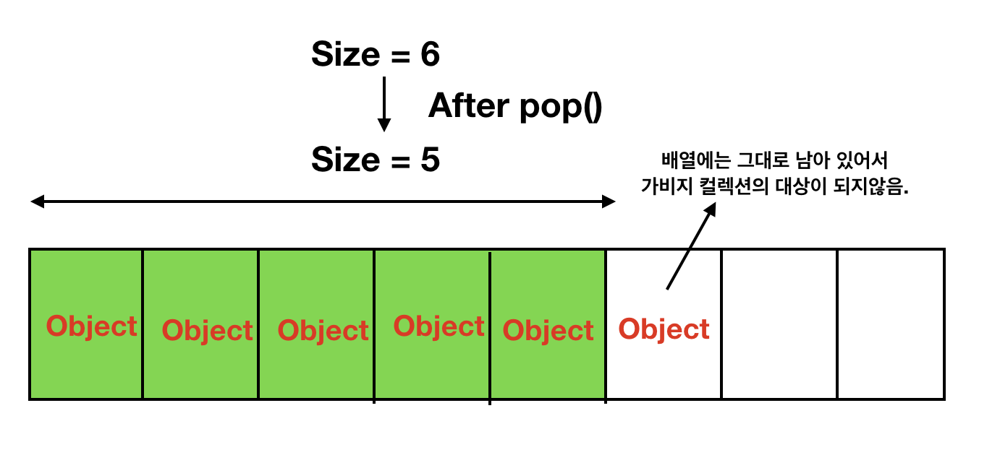

객체 참조를 null 처리하는 일은 예외적인 경우여야 한다.

**메모리 누수가 나는 Stack**
```java
public class Stack {
  private Object[] elements;
  private int size = 0;
  private static final int DEFAULT_INITIAL_CAPACTIY = 16;
  
  public Stack() {
    elements = new Object[DEFAULT_INITIAL_CAPACTIY];
  }
  
  public void push(Object e) {
    ensureCapacity();
    elements[size++] = e;
  }
  
  public Object pop() {
    if(size == 0)
      throw new EmptyStackException();
    return elements[--size];
  }
  
  private void ensureCapacity() {
    if(elements.length == size)
      elements = Arrays.copyOf(elements, 2 * size + 1);
  }
}
```
위에 있는 Stack 클래스는 테스트 코드를 돌리면 문제 없이 동작하지만, 내부적으로 메모리 누수 문제를 갖고 있어, 메모리 사용량이 늘어나 결국 성능이 저하된다.

**그럼 어디서 메모리 누수가 일어 날까?**
바로 pop() 메소드에서 일어나게 된다.
pop() 메소드는 Stack에서 객체 하나를 제거한 후, 제거한 원소를 반환하는 메소드이다. 그치만 실제 코드를 보면, 사이즈의 크기를 하나를 줄여서 마치, 제거된 것 처럼 보인다.
가비지 컬렉션 입장에서 생각해보면, 제거된 객체는 아직 elements 배열에서 물고 있기 때문에, 마치 사용하고 있는 것 처럼 보인다.
Stack 클래스가 메모리 누수에 취약한 이유는 바로 스택이 자기 메모리를 직접 관리하기 때문이다. 이 스택은 elements 배열로 저장소 풀을 만들어 원소들을 관리한다. 배열의 활성영역(즉 size 까지의 범위)들은 사용되고, 비활성화 영역은 쓰이지 않는다. 문제는 가비지 컬렉터는 이 사실을 알 길이 없다는 데 있다. 가비지 컬렉터가 보기에는 비활성 영역에서 참조하는 객체도 똑같이 유효한 객체다. 비활성화 영역의 객체가 더 이상 쓸모 없다는 건 프로그래머만 아는 사실이다.


pop() 후

그러므로 프로그래머는 비활성 영역이 되는 순간 null 처리를 해서 해당 객체를 더는 쓰지 않을 것임을 가비지 컬렉터에 알려야 한다.

**수정한 pop메서드**
```java
public Object pop() {
  if(size == 0)
    throw new EmptyStackException();
  Object result = elements[--size];
  elements[size] == null; // 다 쓴 참조 해제
  return result;
}
```

다 쓴 참조를 해제하는 가장 좋은 방법은 그 참조를 담은 변수를 유효범위 밖으로 밀어내는 것.
일반적으로 자기 메모리를 직접 관리하는 클래스라면 프로그래머는 항시 메모리 누수에 주의해야 한다.
원소를 다 사용한 즉시 그 원소가 참조한 객체들을 다 null 처리해줘야 한다.

캐시는 메모리 누수를 일으키는 주범이다.
**WeakHashMap을 사용하는 예제**
```java
public class WeakHashMapTest {
 
    public static void main(String[] args) {
        WeakHashMap<Integer, String> map = new WeakHashMap<>();
 
        Integer key1 = 1000;
        Integer key2 = 2000;
 
        map.put(key1, "test a");
        map.put(key2, "test b");
 
        key1 = null;
 
        System.gc();  //강제 Garbage Collection
 
        map.entrySet().stream().forEach(el -> System.out.println(el));
      	//결과로 key2만 찍힌다.
    }
}
```
캐시를 만들 때 보통은 캐시 엔트리의 유효 기간을 정확히 정의하기 어렵기 때문에 시간이 지날수록 엔트리의 가치를 떨어뜨리는 방식을 흔히 사용한다. 이런 방식은 스케줄러나, 스레드풀 같은 백그라운드 스레드를 활용하거나 캐시에 새 엔트리를 추가할 때 부수 작업으로 수행하는 방법이 있다. LinkedHashMap은 removeEldestEntry 메서드를 써서 후자의 방식으로 처리 한다. 더 복잡한 캐시를 만들고 싶다면 java.lang.ref 패키지를 직접 활용해야 할 것이다.

**LinkedHashMap.removeEldestEntry() 더 알아보기**

이 메소드는 map에서 오래된 엔트리를 제거할지 말지 지속적으로 추적하기 위해 사용된다. 그래서 LinkedHashMap에 요소를 추가할 때 오래된 엔트리는 맵에서 제거된다. 이 메소드는 주로 put()이나 putall() 메소드가 호출되고나서 호출된다.

이 메소드는 map에서 오래된 엔트리를 하나씩 삭제하여 메모리 사용을 줄이기 때문에 캐시를 이용할 때 매우 유용하다.
**예제**
```java
public class Main {
    private static final int MAX_ENTRIES = 5;

    public static void main(String[] args) {
        LinkedHashMap lhm = new LinkedHashMap(MAX_ENTRIES + 1, .75F, false) {
            protected boolean removeEldestEntry(Map.Entry  eldest) {
                return size() >  MAX_ENTRIES;
            }
        };
        lhm.put(0, "H");
        lhm.put(1, "E");
        lhm.put(2, "L");
        lhm.put(3, "L");
        lhm.put(4, "O");
        lhm.put(5,"!");

        System.out.println(lhm);
    }
}
```
**결과로 E L L O ! 만 찍힌다.**


메모리 누수의 마지막 주범은 리스너(listener) 혹은 콜백(callback) 이라 부르는 것이다. 클라이언트가 콜백을 등록만 하고 명확히 해지하지 않는다면, 뭔가. 조치해주지 않는 한 콜백은 계속 쌓여갈 것이다. 이럴 때 콜백을 약한 참조로(weak reference)로 저장하면 가비지 컬렉터가 즉시 수거해간다. 예를 들어 WeakHashMap에 키로 저장하면 된다.

메모리 누수는 겉으로 잘 드러나지 않아 시스템에 수년간 잠복하는 사례도 있다. 이런 누수는 철저한 코드 리뷰나 힙 프로파일러 같은 디버깅 도구를 동원해야만 발견되기도 한다. 그래서 이런 종류의 문제는 예방법을 익혀두는 것이 매우 중요하다.

> 참고자료
[https://d2.naver.com/helloworld/329631](https://d2.naver.com/helloworld/329631)